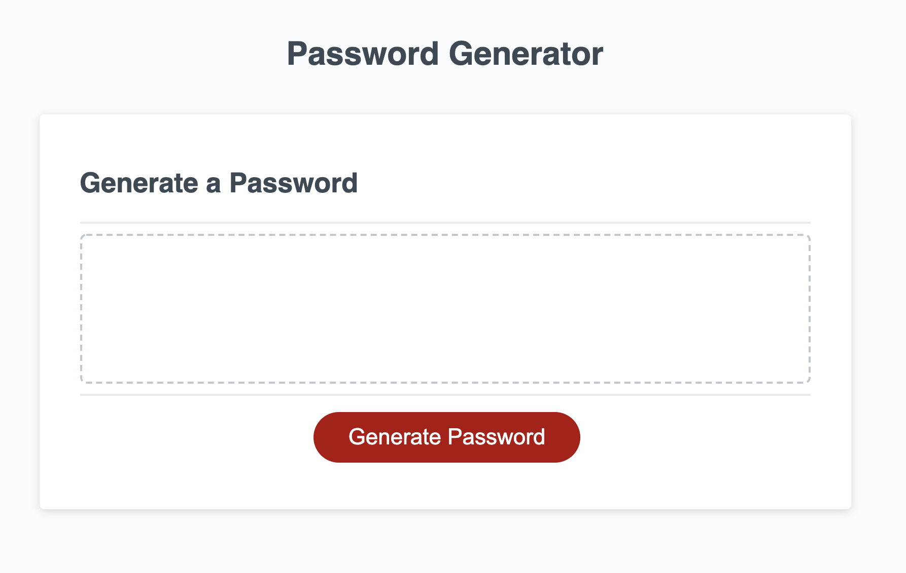

# Password-Generator

This project allows the user to generate a random password based on the criteria they choose in the prompts.

## How To Use

To use the password-generator, you simply start by clicking the 'Generate Password' button. Follow the prompts to select the criteria you desire for your secure password. After all criteria is selected, the password is then displayed on the page.

### Screenshot

#### Links:
[Linkedin](https://www.linkedin.com/in/cdfox/)

[GitHub](https://github.com/CFox2019)
